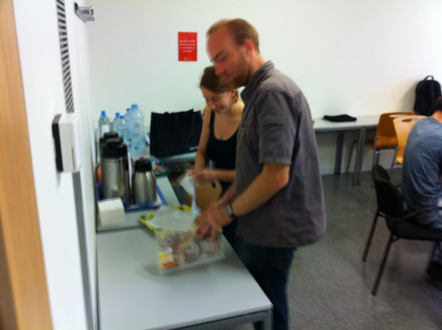
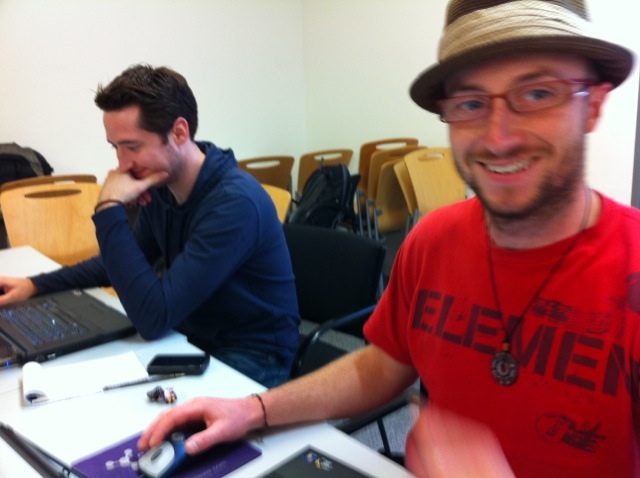
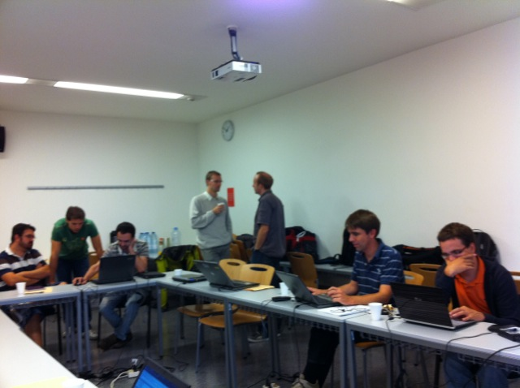
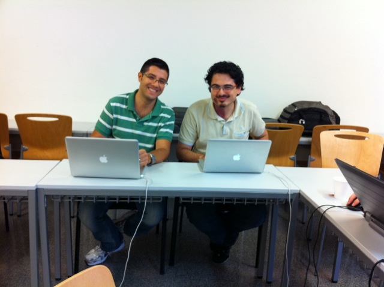

1. Event pictures
{|
|align="left"|This was a working meeting - we wrote and debugged a lot of code!.
|
|
|
|
|}

  1. Introduction
**Date:** September 13-17 2010

**Location:** 
Barcelona

**Goal:** A follow on to the wildly successful [March 2010 pre-hackfest](http://www.na-mic.org/Wiki/index.php/Events:CTK-Pre-Hackfest-2010) and [May 2010 hackfest](CTK-Hackfest-May-2010.html) .

**Requirements:** attendees must be enthusiastic about CTK and willing to spend their time with the details of dicom, git, cmake, c++, Qt, vtk, itk, openinventor, and related technologies.  People who do not feel qualified for this are politely not invited :)

**Group size:** maximum 20 participants so we can have a manageable working meeting.  The organizing committee will invite and select participants based on input from [TheTeam](TheTeam.html).

**Organizers:** Ivo Wolf, Steve Pieper, Stephen Aylward

**Site Hosts:** TBD

**Attendees:** (due to limited space, please contact the organizers to attend)
1. Steve Pieper,                     Isomics, Inc., USA
1. Ivo Wolf,                         Hochschule Mannheim and DKFZ, Germany
1. Marco Nolden,                     DKFZ, Germany
1. Sascha Zelzer,                    DKFZ, Germany
1. Julien Finet,                     Kitware, USA
1. Jean-Christophe Fillion-Robin     Kitware, USA
1. Xavi Planes,                      UPF, Spain
1. Pedro Omedas                      UPF, Spain
1. Yves Martel                       UPF, Spain
1. Benoit Bleuze                     INRIA, France
1. Daniele Giunchi,                  Italy
1. Paolo Quadrani,                   Italy

*Virtual Attendees (by email or phone): Lawrence Tarbox, Michael Onken, Stephen Aylward*

**Future Events:** The organizing committee invited a group of developers to get the CTK project started and we've believe we've reached capacity for this event.  Future hackfests will be announced in advance and we hope lots of people will be interested in participating.  The venue and activities at future hackfests will be determined based on the number of active participants in the project.

  1. Preparation
Developers should bring a laptop with the [current CTK source code](http://github.com/commontk/CTK) downloaded and [built](Build-Instructions.html).

Use the [CTK developers mailing list](http://public.kitware.com/cgi-bin/mailman/listinfo/ctk-developers) to discuss build issues and topics for ongoing work.

**We plan to hold weekly phone conferences during the month leading up to the actual hackfest.  Be prepared to discuss projects so we can make the most effective use of the face-to-face hackfest time.**

  1. Preliminary Agenda
Nominally 9am to 5pm each day Monday through Friday.  Monday will start with a review of the topics.  Anyone who has prepared material they would like to present can suggest a time slot so a detailed agenda for the rest of the week can be prepared.  Unless otherwise allocated, it is expected that the time will be spent hacking, with ad hoc discussions and debugging sessions as needed.

**Monday*
** 9am - welcome
** Everyone should say a few words of what they want to accomplish during the week.  Also state if you would like to present on a topic and lead a discussion so these can be added to the agenda.
** Review of git methodologies (Jc, Benoit, Sascha and all)
** Options for C++ DICOM Application Hosting implementation in CTK (Sascha and other) [Presentation](mediaDicomAppHosting.pdf.html)
** Questions for packaging CTK in debian: 1) what to enable as 'standard ctk' 2) package name: commontk or ctk? 3) build against VTK trunk or release version?  Same question for DCMTK, Qt, etc...
** Demos/Presentation: CreatTools, DTK/MedInria, MAF Scripts 
**Tuesday*
**Wednesday*
** afternoon status update from everyone, review to-do items for the rest of the week.
**Thursday*
**Friday*
** afternoon summary of progress and discussion of ongoing work, future {talk,hack}fests...

  1. Topics and Projects
Pick up threads of discussion and activity from [Pre-Hackfest](http://www.na-mic.org/Wiki/index.php/Events:CTK-Hackfest-2010) and [May 2010 Hackfest](CTK-Hackfest-May-2010.html)

General set of topics (attendees, please flesh this out with your own ideas!)

    1. Schedule Talkfest
- Pick a time and place for a talkfest in the US (perhaps at Washington University in St. Louis).

    1. Review driving application
- First: Define the purpose of CTK:
** Candidate: CTK is meant to span the boundaries of current toolkits and applications.   Specifically, its parts are intended to be easily integrated into current software systems and help them address software engineering challenges that impede their clinical use.   We are currently focusing simplifying the challenging tasks of (1) integrating DICOM QR functionality into applications (i.e., thereby enabling the integration of applications into the data workflow of a clinical environment) and (2) providing clean and effective user interfaces that are appropriate for use in a clinical environment (e.g., intuitive user-interface widgets for window and level selection).   Future challenges to be addressed include methods for software testing, event handling, and more.
- Second: Define the driving application to be bundled with CTK (that demonstrates the utility of CTK).
** "cool" application for users = "WOW!" application for computer scientist
** Candidate: The WOW! application could be achieved by working towards three goals:
*** Goal1: Provide Qt widgets for browsing data on a PACS and downloading (QR) select images to local disk.
**** Should support batch download based on selected slices, series, studies, and patients.
**** Would be nice to save in another format such as NIFTI, but that is a nice-to-have.
**** Query/browse Qt widget would show results as a tree (patient, study, series, images) with optional keys (sex, etc), when available
**** Provide progress reporting of transfers
**** This would be HUGE for the community.   Imagine having a small set of Qt/DCMTK widgets that combined together form a QR workstation.  This is a great place to start sharing.
*** Goal2: slice-based view of downloaded data (data on disk)
**** Qt image viewer with intensity window/level and not much more.   This is meant to be minimalistic.
*** Goal3: initiate processing on data (server-based data or downloaded data) using the dicom plug-in standard
**** This is where we can really help the community.  Provide a C++ reference implementation, and some Qt widgets that help initiate calls to available services.

    1. Organization and Workflow
- First day will be dedicated to code organization and policies for git-based workflow.
** expected result will be a set of procedures for dissemination to the ctk community for comment and adoption.

    1. DICOM
- Review of ITKv4 DICOM Plans and discussion of DCMTK and GDCM.

    1. Widgets
- Review status of Qt-based CTK widget developments
** Slicer4, DTK, GoFigure (others?)

    1. Plugins, Modules
(utilities for discovering and invoking code blocks)
- Use case demonstrating the benefits of the plugin framework (Slicer Command Line Plugins?)
- Integration of Qt SOAP (?) http://qt.nokia.com/products/appdev/add-on-products/catalog/4/Utilities/qtsoap/ for DICOM application hosting

Old:
- Plugins: not-application dependent (like a java plugin that runs in firefox or internet explorer or in our case something like a registration routine that gets invoked from a host application)
- Modules: rely on some of the API of the host application (like a loadable module that creates a custom GUI using a Qt API so it may work in more than one Qt-based application)

    1. Interoperability
(plugin toolkits together)
- VTK/OpenInventor shared OpenGL rendering context

    1. Events and Communications
(run-time messaging within and among applications)
- ZMQ
- OpenIGTLink
- Event Bus (MAF, Patrick's ZMQ)

    1. Integration
(using CTK code in different applications)
- Change the private implementation macros to behave like Qt (derivable pimples)
- Improve unit testing macros (interactive mode, property check...)

  1. Progress Reports and Updates
    1. Wednesday
- DICOM Application Hosting:
** architecture of client/server web services is coming together - examples are coming soon.
** mods to CTK build system so only need libraries and includes are only included if needed (avoid compile/link errors)
** will send a pointer to Lawrence for comment.
- DICOM test application [http://github.com/pieper/CTK/commit/304990558a522b391da7aaa31e1642f8deb37e09](http://github.com/pieper/CTK/commit/304990558a522b391da7aaa31e1642f8deb37e09) [http://github.com/pieper/CTK/commit/0571b151312db2b310bf0a5dd1aa189294eeb3be](http://github.com/pieper/CTK/commit/0571b151312db2b310bf0a5dd1aa189294eeb3be)
** requires change currently only in [this dcmtk fork](http://github.com/pieper/DCMTK)
- creating new dcmtk fork in commontk that can track dcmtk.org
- bbtk (CreaTools) merged with ctk on Jc branch - integrated with console and superbuild
- new CTKLauncher (sets environment before starting real app)
** will be available for any app
- Changover to CTK pimpl macros to use Qt style [http://github.com/commontk/CTK/commit/bab18744b88d3166d37bdcb628389ec46c782398](http://github.com/commontk/CTK/commit/bab18744b88d3166d37bdcb628389ec46c782398)
- Command Line module switchover so slicer command line modules can be used in any ctk app
- MAF bus with patches to work with QtSOAP (patches to QtSOAP in cmake) and how to connect map MAF signal/slots to Qt 
** Removing MAF dependencies from event bus code to commit to ctk
- Qt application host - pick app, start/stop, listen for SOAP messages.  Also manages screen area for hosted app.  
- Should have an example tomorrow that uses server and service.  
- Some common code shared between client and server

    1. Friday
- Discussed and agreed on a [git commit style](Contributing-to-CTK.html#Git_Commit_Style)
- Pushed changes to commontk/DCMTK on github as proper fork of the offis dcmtk.org git [http://github.com/commontk/DCMTK](http://github.com/commontk/DCMTK)
- MAF event bus and plug in now in ctk (extracted from MAF)
** demo application is close to finished
** loads plugin
** code is in a branch on Danielle's fork [http://github.com/dgiunchi/CTK/commits/mafEventBusBranch](http://github.com/dgiunchi/CTK/commits/mafEventBusBranch)
- Inherit include paths from external projects added to build system
- Architecture of integration of command line modules into GIMIAS as example of general purpose utilities (involves moving XML parser into ctk)
- CTK being integrated in GIMIAS (need to add dependencies of Qt in build system)
- (TODO: example of external application that uses CTK using a find_package)
- Application Hosting
** protocol to start and monitor applications
** finishing data exchange 
** ctk host can talk with ctk hosted application
*** start/stop/resize/progress messages
*** dicom data sending and file paths are being sorted out
** currently trying to talk with xip host/app
** wsdl types are being sorted out (some intermittent windows / java / .net issues)
** working remotely Lawrence on debugging
** [summary wiki page](Documentation/DicomApplicationHosting.html)
- Discussed testing and dashboards
** ctk tests include gui testing, so linux clients need to have access to X server (possibly using Xvfb)
- ctkLauncher pretty close to working [http://github.com/jcfr/CTKAppLauncher](http://github.com/jcfr/CTKAppLauncher)
- dicom query retrieve example application is now in commontk on github and is [enabled as a test](http://github.com/commontk/CTK/tree/81897d57563348b95e63172ebcbc325963a2e1e9/Applications/Testing/Cpp)

    1. Next Steps
- Next Hackfest
** Proposal is sometime in February in Orlando (possibly before or after SPIE)
- Need for a Talkfest
** Possibly a one or two day meeting.  Even a dedicated phone call would be a good idea.
- Focus on Application Hosting
** need examples of working binaries in various languages
** it would be good for CTK to have the reference C++ implementation and contribute to the spec
** a good application hosting solution has the potential to be the WOW application of ctk
- Need better documentation and example for using ctk in other applications
- Distributing Binaries
** Still have the dependencies on non-release versions of upstream tools (e.g. VTK and DCMTK)
** need to have method for maintaining binary compatibility when distributing bug fixes, e.g. http://ispras.linux-foundation.org/index.php/ABI_compliance_checker

  1. Travel  Hotel
**Travel** 

*Airport
** El Prat (airport code: BCN). Located at 15km from the city center, is where most international flights arrive. Accessible by Train, Bus+Metro and Taxi.
*** Option 1. Take the [AeroBus](http://www.sgmt.cat/aerobus/index.php/en/linies.html) to "Barcelona-Pl. Catalunya" (5 eur 30 min). Take the [underground](http://www.tmb.net/img/genplano.pdf) L1 red line direction L1-Fondo, from L1-Catalunya to L1-Gl�ries (1,4 eur 10 min). Take care of your wallet in the city center.
*** Option 2. Take the taxi until Glorias shopping centre (30 eur 30 min)
** Girona (airport code: GRO). Located at 90 km from Barcelona, low cost flights from Ryanair company arrive here. Only accessible by Bus. 
*** Take the [Sagales bus](http://www.sagales.com/pubdocs/1799_aeroport-girona-costa-brava---barcelona-%28estacio-nord%29-2010-06-14.pdf) (Barcelona way) to "Estacio del Nord" in Barcelona (75 min). In "Estacio del Nord" take the [underground](http://www.tmb.net/img/genplano.pdf) red line L1 direction L1-Fondo, from L1-Arc de Triomf to L1-Gl�ries (1,4 eur 10 min).

*Location
** The event will occur in Communication Campus of the Universitat Pompeu Fabra, Barcelona.
** [Universitat Pompeu Fabra  CISTIB](http://cilab2.upf.edu): C/ Roc Boronat , 138, 08018 Barcelona
** [Gooogle Map location](http://maps.google.com/maps?f=qsource=s_qhl=engeocode=q=C%2F+Roc+Boronat,+138,+08018+Barcelona,+Espa%C3%B1a+(Universitat+Pompeu+Fabra)sll=41.397608,2.15538sspn=0.052796,0.132093ie=UTF8hq=hnear=Carrer+de+Roc+Boronat,+138,+08018+Barcelona,+Catalunya,+Spaint=hz=17). The building is finished, even if in the map appears in construction :-)
** Meeting room number is 52.421

**Hotel**

We have made a pre hotel booking for CTK in a hotel that is very close to the meeting place. We booked 10 rooms (individual or double). Theres a reduced price for UPF (15%), so you can directly contact to the hotel using the name CTK UPF and you will get the reduction. This reduction will be applied individually, not for a group.

To formalize this pre hotel booking you need to contact with the hotel and provide the credit card number and Expiry date. This pre hotel booking is valid until 06.09.10. If you will stay more days in Barcelona, you can request these to the hotel as soon as possible.

*Details:*
- Hotel booking name: CTK UPF
- Hotel: Hotel Amrey Diagonal: http://www.amrey-hotels.com/hoteldiagonal/home.php?lang=ENc=1
- Arrival date: 13.09.10 (Monday)
- Departure date: 17.09.10 (Friday)
- Daily rate:
** 95.89 � VAT Incl.  DOBLE
** 85.79 � VAT Incl.  SINGLE
- Breakfast included
- You need to pay directly when you arrive on 13.09.10 until 18H

If you need further details or we can give you more support, please contact Xavier Planes Cid (xplanes at cistib.upf.edu)
 

**Connectivity**
1. We will provide both wired and wireless connection