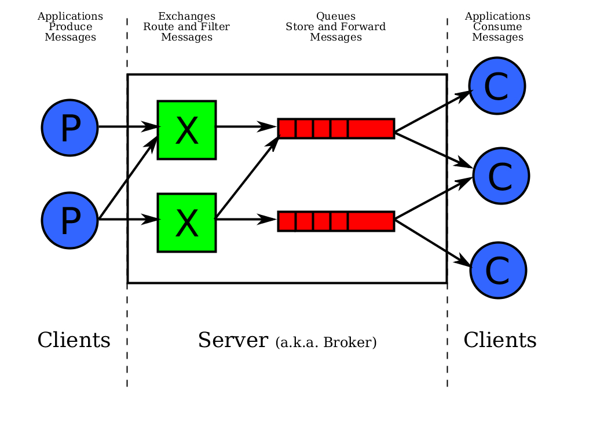
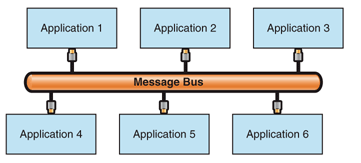

This document was written during the Georgetown Hackfest. In the meantime, a message broker solution has been implemented in the CTK Plugin Framework. A [in-process implementation](../Documentation/CTK-Plugin-EventAdmin-local.html) is available and an [out-of-process implementation](../Documentation/CTK-Plugin-EventAdmin-remote.html) is available for experimentation.

1. Use cases
  1. Event Management
Each component/application generates many different types of events. A centralized event manager (Hub and Spoke) can be used to aggregate/dispatch events
1. Synchronization: Window/Leveling events in one window should be synchronized across all viewer windows
1. Temporal calibration: Different components have different update frequency, a centralized manager can be used to filter UpdateEvents, so the whole system is updating at the same frequency

  1. System Integration
Different system/application have different data format or are running on different physical devices. A event bus can be used for system integration

1. Solution
1. Use[Message Broker](http://msdn.microsoft.com/en-us/library/ff648849(v=pandp.10).aspx) for event management

1. Use [Message Bus](http://msdn.microsoft.com/en-us/library/ff647328.aspx) and [Publisher/Subscriber](http://msdn.microsoft.com/en-us/library/ff649664(v=pandp.10).aspx) design pattern for system integration
{|
|
|
|}

1. Implementation
1. Message layer: [OpenIGTLink](http://www.na-mic.org/Wiki/index.php/OpenIGTLink)
#* OpenIGTLink defines many common data format and message structure
#* It has plain vanilla socket support, might switch to ZeroMQ for transportation
1. Transportation layer abstraction: [ZeroMQ](http://www.zeromq.org/)
#* [ZeroMQ](http://www.zeromq.org/) is a small and fast implementation of the [Advanced Message Queuing Protocol](http://en.wikipedia.org/wiki/Advanced_Message_Queuing_Protocol) under the LGPL license
#* It supports both synchronous and asynchronous messaging mode
#* It supportsTCP, multicast/PGM, inter-process, and inter-thread transportation
#*  CMake version of library can be found here http://github.com/PatrickCheng/zeromq2
#* API can be found here http://api.zeromq.org/zmq.html