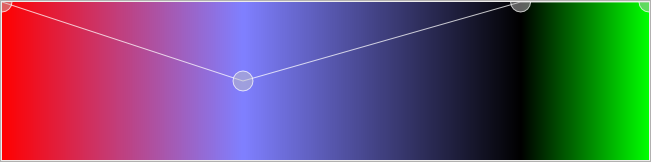
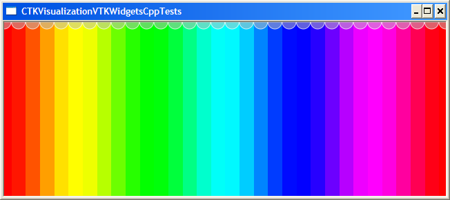
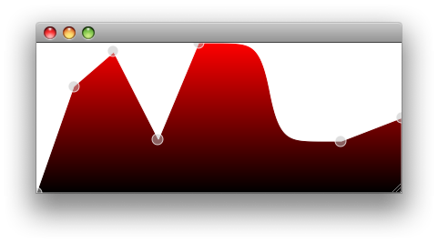
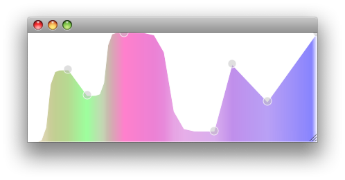
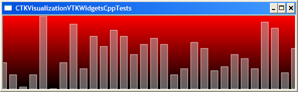

1. ctkTransferFunctionWidget
*Support for VTK functions
Note: The development of the widgets using Qt only has been stopped. We are now orienting the drawing/interaction using VTK Charts. 
**vtkColorTransferFunction
**vtkLookupTable
**vtkPiecewiseFunction
{|
|
|
|--
|
|
|--
|
|}
*Features
** Move points
** Add points

*To do List
** Limits - First and last point behaviour option: clamping, extrapolate, to 0, ...
** Background item
*** View color background (white for the moment)
** Should each point be a different item..?
** Widget items editor
**** Change sharpness, midpoint, color, opacity
** Preset shapes (bell, ...)
** Possibility to drag item
*** scaling and offsetting items
** support histograms (from vtkData)
** add bar graphic item
** remove items feature
** improve items moves
** vertical gradient