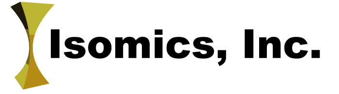
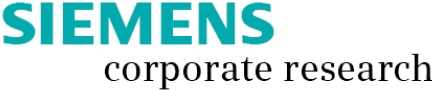
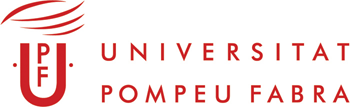
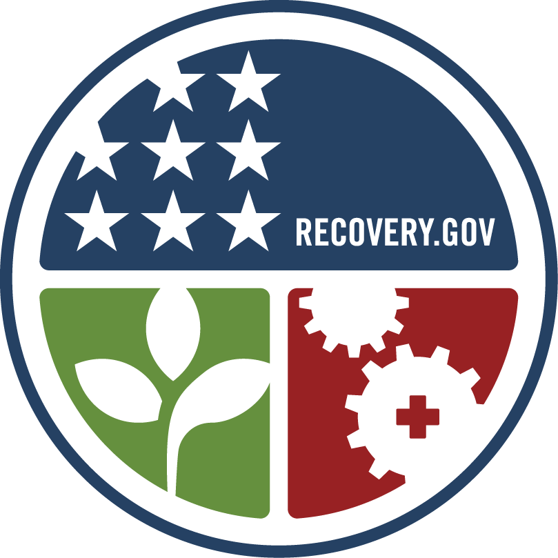
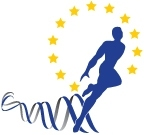
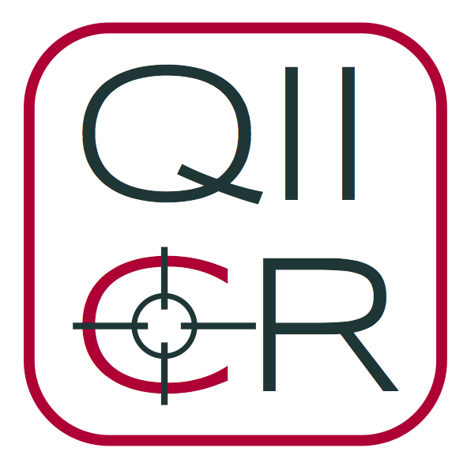

1. Founders
- Hans-Peter Meinzer, German Cancer Research Center, Heidelberg, Germany *(Catalyst of the CTK effort)*
** Marco Nolden, German Cancer Research Center, Heidelberg, Germany
- Ron Kikinis, Harvard Medical School, Boston, MA, USA *(Meeting Chair)*
- Ivo Wolf, Mannheim University of Applied Sciences, Institute for Medical Informatics, Mannheim, Germany
- Steve Pieper, Isomics, Cambridge, MA, USA
- Stephen Aylward, Kitware Inc., Carborro, NC, USA
** Julien Finet, Kitware Inc.
** Jean-Christophe Fillion-Robin, Kitware Inc.
** Julien Jomier, Kitware Inc. 
** Will Schroeder, Kitware Inc., Clifton Park, NY, USA
- Kevin Cleary, Georgetown University, Washington DC, USA
** Patrick Cheng, Georgetown University, Washington DC, USA
** Ziv Yaniv, Georgetown University, Washington DC, USA
- Lawrence Tarbox, Mallinckrodt Institute of Radiology, St.Louis, MO, USA
- Marco Viceconti, Laboratorio di Tecnologia Medica, Bologna, Italy
** Daniele Giunchi, SCS - B3C , Bologna Italy
** Paolo Quadrani, SCS - B3C , Bologna Italy
- Michael Onken, OFFIS DICOM Team, Oldenburg, Germany
- Nicholas Ayache, Sophia Antipolis, Inria, France
** Olivier Clatz, Sophia Antipolis, Inria, France
** Maxime Sermesant, Sophia Antipolis, Inria, France
** Pierre Fillard, Sophia Antipolis, Inria, France
- Gianluca Paladini, Siemens Corporate Research, Princeton, NJ, USA
- David Clunie, PixelMed Publishing, Bangor, PA, USA

1. Supporting institutions
{| cellspacing="20"
|
||Prof. Dr. Hans-Peter Meinzer
|
||Stephen Aylward, Ph.D.
|-
|
||Prof. Kevin Cleary, Ph.D.
|
||Nicholas Ayache, Ph.D
|-
|
||Steve Pieper, Ph.D.
|
||Prof. Dr. Ivo Wolf
|-
|
||Michael Onken
|
||David Clunie
|-
|
||Gianluca Paladini
|[Surgical Planning Laboratory](http://www.spl.harvard.edu)
||Prof. Dr. Ron Kikinis
|-
|
||Prof. Sebastien Ourselin
|
||
|-
||
||Prof. Lawrence Tarbox, Ph.D.
||
||Prof. Alejandro Frangi, Ph.D.
Prof. Marco Viceconti, Ph.D.
|}

1. Individual contributors
The following data is retrieved from [OpenHub](http://www.openhub.net/p/ctk/contributors?query=&sort=commits), showing
all active contributors during the last two years (as of 30th October 2014) with at least 10 commits:

- Jean-Christophe Fillion-Robin
- Julien Finet
- Sascha Zelzer
- Steve Pieper
- Marco Nolden
- Matt Clarkson
- Andreas Fetzer
- Ivo Wolf
- Miklos Espak
- Michael Onken
- Alireza Mehrtash
- Nicolas Toussaint
- Stefan Baumann

1. Projects contributing to CTK
<gallery widths="200px" perrow="3">
File:3DSlicer_logo_en.png|[3D Slicer](http://www.slicer.org)
File:Gimias_logo_en.png|[Gimias](http://www.gimias.org)
File:MAF3_logo_en.png|[Maf](https://www.biomedtown.org/biomed_town/maf3)
File:MedInria.png|[medInria](http://med.inria.fr)
File:Mitk_logo_en.png|[Mitk](http://www.mitk.org)
File:ParaView_logo.png|[ParaView](http://www.paraview.org)
File:QIICR_logo.png|[Quantitative Image Informatics for Cancer Research (QIICR)](http://qiicr.org)
</gallery>

1. Grants, Fundings and Sponsors
{|
| || Air Force Research Laboratories under Phases I and II of the SBIR contract "[Generating Labeled Voxelization for Numerical Simulation](http://www.vtk.org/Wiki/Maverick)," 
Topic: AF06-034, Contract #: `FA8650-07-C-6756`
|-
| || [ARRA supplement](http://wiki.na-mic.org/Wiki/index.php/Projects:ARRA:SlicerUI) to [NAC](http://nac.spl.harvard.edu)
|-
| || [Cognition Guided Surgery, SFB/Transregio 125](http://www.cognitionguidedsurgery.de/)
|-
| || [National Alliance for Medical Image Computing](http://www.na-mic.org)
|-
| || [Neuroimage Analysis Center](http://nac.spl.harvard.edu)
|-
| || [Virtual Physiological Human Network of Excellence](http://www.vph-noe.eu/)
|-
| || [Quantitative Image Informatics for Cancer Research (QIICR), NIH National Cancer Institute, award U24 CA180918](http://qiicr.org)
|}